# AutoPart AI - Multi-Agent Spare Parts Assistant


This project is a LangGraph-based multi-agent system for car spare parts recommendations.
It combines:

- Local structured inventory data (SQLite)
- Technical catalog/document retrieval (RAG over FAISS)
- External market context (DuckDuckGo search)
- Final answer synthesis with Gemini

It includes both a CLI flow and a Streamlit demo app.

## Features

- Multi-agent orchestration with LangGraph (`db -> rag -> web -> compiler`)
- SQL agent over `data/spare_parts.db`
- PDF ingestion pipeline to FAISS vectorstore
- RAG question answering over catalog content
- Market comparison using web search snippets
- Final response rewriting into natural customer-facing text
- Streamlit UI with trace and per-source breakdown tabs

## Project structure

```
agent_car_spare_parts/
├── data/
│   ├── spare_parts.db
│   ├── catalog.pdf
│   └── vectorstore/
├── src/
│   ├── graph.py
│   ├── state.py
│   ├── nodes/
│   │   ├── db_specialist.py
│   │   ├── rag_expert.py
│   │   ├── web_researcher.py
│   │   └── compiler.py
│   └── tools/
│       ├── sql_tool.py
│       ├── rag_tool.py
│       └── search_tool.py
├── demo_app.py
├── ingest_docs.py
├── main.py
├── test.py
└── requirements.txt
```

## Architecture

### Graph flow

```mermaid
flowchart LR
    %% Main execution lane
    subgraph PIPELINE [<b>⚙️ LangGraph Sequential Pipeline</b>]
        direction LR
        A([<b>📥 User Input</b><br/><i>state.input</i>]) 
        
        subgraph AGENTS [<b>Agent Nodes</b>]
            direction LR
            B[[<b>🔍 DB Specialist</b>]]
            C[[<b>📚 RAG Expert</b>]]
            D[[<b>🌐 Web Researcher</b>]]
            E[[<b>📝 Compiler</b>]]
        end
        
        F([<b>📤 Final Answer</b><br/><i>state.final_answer</i>])
    end

    %% External sources
    subgraph SOURCES [<b>📦 External Data Sources</b>]
        direction TB
        G[(<b>🗄️ SQLite DB</b><br/>local_inventory.db)]
        H[(<b>🧠 FAISS Index</b><br/>vectorstore)]
        I[(<b>📡 Web Search</b><br/>DuckDuckGo)]
    end

    %% Flow Connections
    A --> B
    B --> C
    C --> D
    D --> E
    E --> F

    %% Source Connections
    G -.-> B
    H -.-> C
    I -.-> D

    %% Visual styles
    classDef io fill:#f0f4ff,stroke:#5c7cfa,stroke-width:2px,color:#2b3674,font-weight:bold;
    classDef agents fill:#ffffff,stroke:#1e293b,stroke-width:2px,color:#1e293b;
    classDef sources fill:#e6fcf5,stroke:#099268,stroke-width:2px,color:#099268;
    classDef subGraphStyle fill:#f8fafc,stroke:#cbd5e1,stroke-dasharray: 5 5;

    class A,F io;
    class B,C,D,E agents;
    class G,H,I sources;
    class PIPELINE,SOURCES,AGENTS subGraphStyle;
```



1. **DB Specialist** (`src/nodes/db_specialist.py`)
  - Uses a SQL agent to find matching parts, price, status, and compatibility.

2. **RAG Expert** (`src/nodes/rag_expert.py`)
  - Queries FAISS vectorstore built from PDF catalogs and returns technical context.

3. **Web Researcher** (`src/nodes/web_researcher.py`)
  - Searches public web snippets and summarizes market comparison insights.

4. **Compiler** (`src/nodes/compiler.py`)
  - Synthesizes all state outputs into a concise natural-language final response.

### Shared state

Defined in `src/state.py` as `AgentState`:

- `input`: user query
- `db_results`: SQL findings
- `found_parts`: identified part references
- `rag_results`: retrieved technical context
- `web_results`: external market summary
- `final_answer`: final compiled response

## Requirements

- Python 3.10+ (3.13 is supported in this workspace)
- Google API key with Gemini access
- Internet connection for web search and model calls

## Setup

### 1) Create and activate a virtual environment

**Windows (PowerShell):**

```powershell
python -m venv .venv
.\.venv\Scripts\Activate.ps1
```

### 2) Install dependencies

```powershell
pip install -r requirements.txt
```

### 3) Configure environment variables

Create a `.env` file in project root:

```env
GOOGLE_API_KEY=your_google_api_key_here
```

## Data preparation (RAG)

If you add/update PDFs and want to rebuild retrieval index:

```powershell
python ingest_docs.py
```

This script:

- Reads `data/catalog.pdf` with `pdfplumber`
- Splits text into chunks
- Embeds with `BAAI/bge-small-en-v1.5`
- Saves FAISS index to `data/vectorstore/`

## Run the project

### Option A: CLI run

```powershell
python main.py
```

### Option B: Streamlit demo

```powershell
streamlit run demo_app.py
```

The Streamlit app provides:

- Chat interface for user queries
- Agent reasoning trace section
- Data source tabs for:
  - SQL output (`db_results`)
  - RAG output (`rag_results`)
  - Web output (`web_results`)

### Option C: Web research smoke test

```powershell
python test.py
```

## Example query

Try prompts like:

- `I need Alternator 130A Remanufactured`
- `Do you have brake pads for Toyota Corolla 2019?`
- `Compare your offer for oil filter with market pricing`

## Key implementation notes

- SQL source is `sqlite:///data/spare_parts.db`
- RAG index path is `data/vectorstore/`
- Web search uses `DuckDuckGoSearchResults`
- LLM models currently used in nodes are Gemini Flash variants

## Troubleshooting

### Missing API key / model errors

- Ensure `.env` exists and `GOOGLE_API_KEY` is valid.
- Re-open terminal/session after updating `.env`.

### Empty RAG answers

- Rebuild index: `python ingest_docs.py`
- Verify `data/vectorstore/` exists and is populated.

### Streamlit starts but no useful output

- Confirm `data/spare_parts.db` contains records.
- Ensure internet access for web + Gemini calls.

## Future improvements

- Add intent routing for different query types
- Add structured response schema across all nodes
- Add automated tests for each node and integration path
- Normalize dependency versions in `requirements.txt`
